# Joint catalogue

Generated by GluLamb.Gallery from the joint registry; don't edit it by hand. Each joint type is tried on the gallery's
joint conditions, as drawn and with the beam sections turned a quarter turn, each with and without Flip. A cell passes
when the joint builds, no two cut beams overlap and every beam keeps its body. The drawings show each joint cropped
and pulled apart; beams are coloured by their order in the condition, hardware is grey.

| Type | Name | Conditions | Default for | Cells |
|---|---|---|---|---|
| [`glulamb.branch-split`](#glulambbranch-split) | Branch split | Fork | Fork 10°, Fork 20° | 8 ok |
| [`glulamb.corner-lap`](#glulambcorner-lap) | Corner lap | Corner, Fork | Corner 90°, Corner 60°, Corner 120° | 20 ok |
| [`glulamb.corner-lap-blind`](#glulambcorner-lap-blind) | Blind corner lap | Corner, Fork |  | 20 ok |
| [`glulamb.corner-lap-housed`](#glulambcorner-lap-housed) | Housed corner lap | Corner, Fork |  | 20 ok |
| [`glulamb.corner-lap-mitre`](#glulambcorner-lap-mitre) | Mitred corner lap | Corner |  | 12 ok |
| [`glulamb.corner-tenon`](#glulambcorner-tenon) | Corner tenon | Corner, Fork |  | 20 ok |
| [`glulamb.cross-backcut-double`](#glulambcross-backcut-double) | Cross lap, double backcut | Cross |  | 8 ok |
| [`glulamb.cross-backcut-single`](#glulambcross-backcut-single) | Cross lap, single backcut | Cross |  | 8 ok |
| [`glulamb.cross-lap`](#glulambcross-lap) | Cross lap | Cross | Cross 90°, Cross 60° | 8 ok |
| [`glulamb.cross-tapered`](#glulambcross-tapered) | Tapered cross lap | Cross |  | 8 ok |
| [`glulamb.drilling`](#glulambdrilling) | Drilling | Point | Point on a face | 4 ok |
| [`glulamb.end-cut`](#glulambend-cut) | End cut | End | Free end | 4 ok |
| [`glulamb.four-way-split`](#glulambfour-way-split) | Four-way split | FourWay | Four ends | 4 ok |
| [`glulamb.k-plate`](#glulambk-plate) | K plate | K | K 45°/45°, K 60°/40° | 8 ok |
| [`glulamb.k-plate-joist`](#glulambk-plate-joist) | K plate with joist | K | K 45°/45° with a joist | 4 of 4 fail |
| [`glulamb.k-tenon`](#glulambk-tenon) | K mortise and tenon | K |  | 8 ok |
| [`glulamb.plate-pocket`](#glulambplate-pocket) | Plate pocket | Point |  | 4 ok |
| [`glulamb.post-beams`](#glulambpost-beams) | Beams on a post | Post | Post running past, Post running past, 17° skew | 8 ok |
| [`glulamb.post-lap`](#glulambpost-lap) | Lapped beams on a post | Post | Post corner | 4 ok |
| [`glulamb.post-lap-tenon`](#glulambpost-lap-tenon) | Lapped beams on a post, through tenon | Post |  | 4 ok |
| [`glulamb.post-lap-tenon-blind`](#glulambpost-lap-tenon-blind) | Lapped beams on a post, blind tenon | Post |  | 4 ok |
| [`glulamb.splice-birdsmouth`](#glulambsplice-birdsmouth) | Birdsmouth splice | Splice |  | 8 ok |
| [`glulamb.splice-lap`](#glulambsplice-lap) | Lapped splice | Splice | Splice 180°, Splice 165° | 8 ok |
| [`glulamb.splice-scarf-keyed`](#glulambsplice-scarf-keyed) | Keyed scarf splice | Splice |  | 8 ok |
| [`glulamb.splice-tenon`](#glulambsplice-tenon) | Tenon splice | Splice |  | 8 ok |
| [`glulamb.splice-tenon-blind`](#glulambsplice-tenon-blind) | Blind tenon splice | Splice |  | 8 ok |
| [`glulamb.t-butt`](#glulambt-butt) | T butt | T |  | 12 ok |
| [`glulamb.t-dovetail`](#glulambt-dovetail) | T dovetail | T |  | 12 ok |
| [`glulamb.t-housed`](#glulambt-housed) | T housed tenon | T |  | 12 ok |
| [`glulamb.t-lap`](#glulambt-lap) | T lap | T | T 90°, T 60°, T 45° | 12 ok |
| [`glulamb.t-plate`](#glulambt-plate) | T plate | T |  | 12 ok |
| [`glulamb.t-step`](#glulambt-step) | Step joint | T |  | 12 ok |
| [`glulamb.t-tenon`](#glulambt-tenon) | T mortise and tenon | T |  | 12 ok |

## glulamb.branch-split

**Branch split.** Two beams forking from the same point, split apart along a plane between them.

Class `BranchSplitJoint`, 2 part(s), Acute topology.

Offered for: **Fork 10°** (default), **Fork 20°** (default).

| Parameter | Default | Unit | Description |
|---|---|---|---|
| ExtraLength | 0 | length | How far the split runs on past the point where the beams no longer touch. |
| Offset | 0 | length | Offset of the split plane towards beam 1. |
| Added | 10 | length | Extra size added to the cutting surface so it clears the beams. |
| MaximumAngle | 30.02° | angle | Largest angle between the branches that counts as a fork. |
| Flip | false |  | Invert the automatic choice of which beam is on top. |
| ExtensionTolerance | 10 | length | Extra length added to the beam extensions this joint reports. |

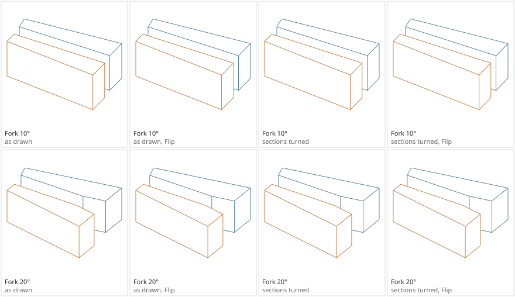

## glulamb.corner-lap

**Corner lap.** Two beam ends meeting at an angle, half-lapped over each other.

Class `CornerLapJoint`, 2 part(s).

Offered for: **Corner 90°** (default), **Corner 60°** (default), **Corner 120°** (default), Fork 10°, Fork 20°.

| Parameter | Default | Unit | Description |
|---|---|---|---|
| Added | 10 | length | Extra length added to cutters so they clear the beams. |
| Inset | 0 | length | Inset of the lap sides from the beam sides. |
| BlindOffset | 0 | length | Material left at the end of the second beam's lap. 0 is a through lap. |
| DowelDiameter | 0 | length | Diameter of a dowel through the lap. 0 = no dowel. |
| Flip | false |  | Invert the automatic choice of which beam is on top. |
| ExtensionTolerance | 10 | length | Extra length added to the beam extensions this joint reports. |

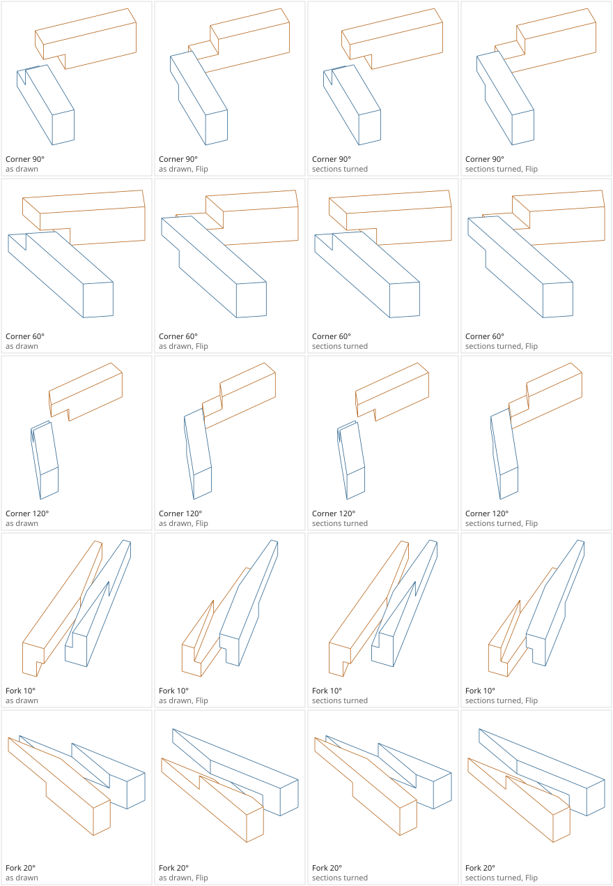

## glulamb.corner-lap-blind

**Blind corner lap.** Two beam ends half-lapped at a corner, one end hidden behind a lip of the other, dowelled.

Class `BlindCornerLapJoint`, 2 part(s).

Offered for: Corner 90°, Corner 60°, Corner 120°, Fork 10°, Fork 20°.

| Parameter | Default | Unit | Description |
|---|---|---|---|
| Added | 10 | length | Extra length added to cutters so they clear the beams. |
| Inset | 0 | length | Inset of the lap sides from the beam sides. |
| BlindOffset | 10 | length | Material left at the end of the second beam's lap. 0 is a through lap. |
| DowelDiameter | 16 | length | Diameter of a dowel through the lap. 0 = no dowel. |
| Flip | false |  | Invert the automatic choice of which beam is on top. |
| ExtensionTolerance | 10 | length | Extra length added to the beam extensions this joint reports. |

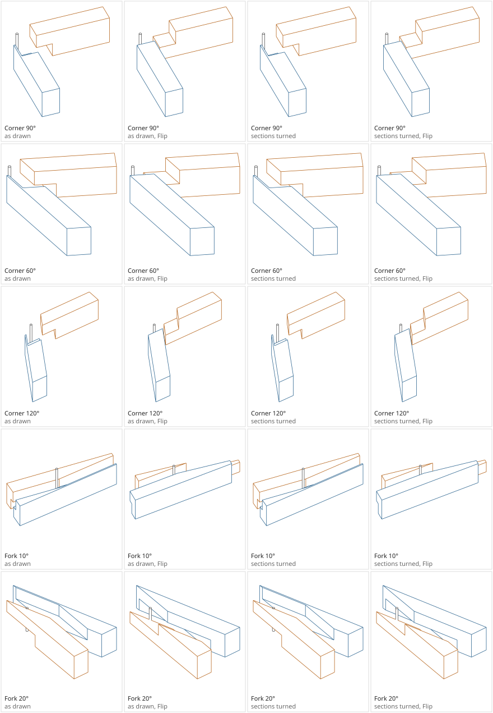

## glulamb.corner-lap-housed

**Housed corner lap.** Two beam ends meeting at an angle, half-lapped with each lap housed in the other beam.

Class `CornerHousedLapJoint`, 2 part(s).

Offered for: Corner 90°, Corner 60°, Corner 120°, Fork 10°, Fork 20°.

| Parameter | Default | Unit | Description |
|---|---|---|---|
| Inset | 3 | length | Inset of the outer faces of the tenon. |
| InsetIn | 15 | length | Inset of the inner faces of the tenon. |
| AngleLimit | 5.73° | angle | Below this angle, the tenon is only cut partway into the inner side. |
| FilletRadius | 11 | length | Fillet radius of the outline corners, e.g. the tool radius. |
| BackOffset | 100 | length | Length of the tenon back from the joint position. |
| CutterHeight | 120 | length | Minimum height of the cutters above and below the joint plane. They are always at least as tall as the deepest beam. |
| Flip | false |  | Invert the automatic choice of which beam is on top. |
| ExtensionTolerance | 10 | length | Extra length added to the beam extensions this joint reports. |

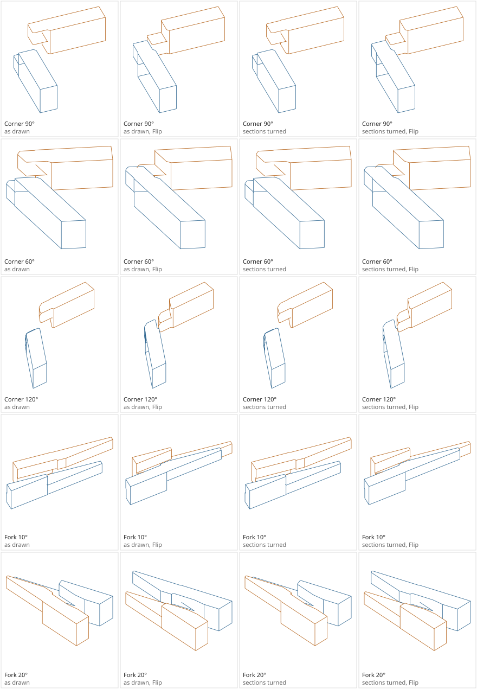

## glulamb.corner-lap-mitre

**Mitred corner lap.** Two beam ends half-lapped at a corner, with a mitre on the top face.

Class `MitreCornerLapJoint`, 2 part(s).

Offered for: Corner 90°, Corner 60°, Corner 120°.

| Parameter | Default | Unit | Description |
|---|---|---|---|
| Added | 10 | length | Extra size added to cutters so they clear the beams. |
| DowelDiameter | 0 | length | Diameter of a dowel through the lap. 0 = no dowel. |
| Flip | false |  | Invert the automatic choice of which beam is on top. |
| ExtensionTolerance | 10 | length | Extra length added to the beam extensions this joint reports. |

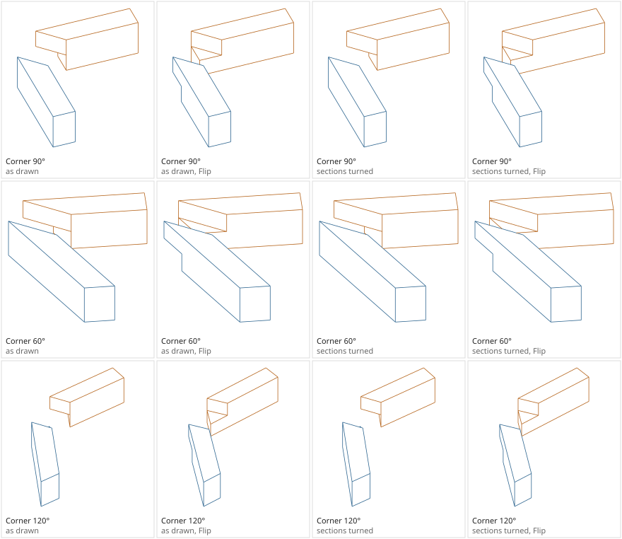

## glulamb.corner-tenon

**Corner tenon.** Two beam ends meeting at a corner, one with a through tenon in a slot in the other.

Class `CornerTenonJoint`, 2 part(s).

Offered for: Corner 90°, Corner 60°, Corner 120°, Fork 10°, Fork 20°.

| Parameter | Default | Unit | Description |
|---|---|---|---|
| TenonThickness | 0 | length | Tenon thickness, across the plane of the joint. 0 = a third of the thinner beam. |
| TenonOffset | 0 | length | Offset of the tenon from the middle, along the joint normal. |
| Clearance | 0 | length | Clearance on each side of the tenon in the slot. |
| DowelDiameter | 0 | length | Diameter of a peg through the joint, along the joint normal. 0 = no peg. |
| Added | 10 | length | Extra size added to cutters so they clear the beams. |
| Flip | false |  | Invert the automatic choice of which beam is on top. |
| ExtensionTolerance | 10 | length | Extra length added to the beam extensions this joint reports. |

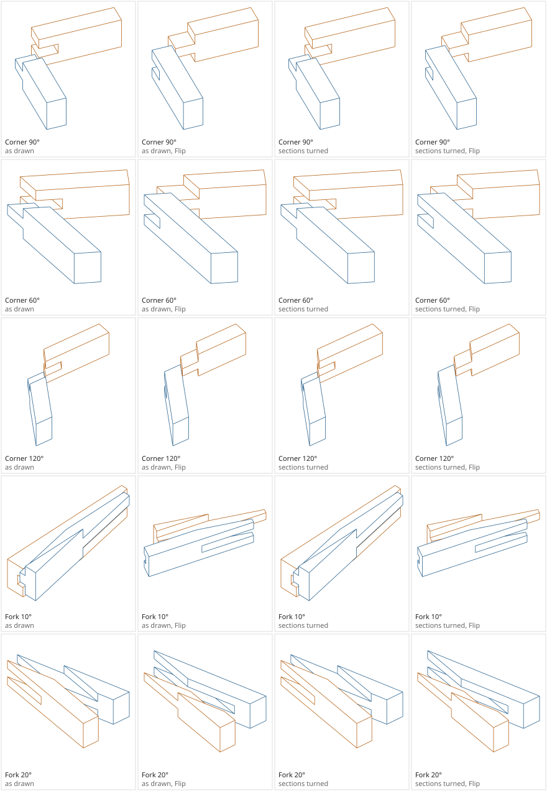

## glulamb.cross-backcut-double

**Cross lap, double backcut.** Cross lap with backcuts on both beams, following curved beam sides.

Class `CrossDoubleBackcutJoint`, 2 part(s), Cross topology.

Offered for: Cross 90°, Cross 60°.

| Parameter | Default | Unit | Description |
|---|---|---|---|
| Offset1 | 3 | length | Offset of the backcut faces from the beam faces. |
| Offset2 | 3 | length | Extra width of the backcut faces. |
| Extension | 2 | length | Extension of the side surfaces past the beam ends. |
| OffsetCentre | 10 | length | Width of material left in the centre of the lap. |
| Flip | false |  | Invert the automatic choice of which beam is on top. |
| ExtensionTolerance | 10 | length | Extra length added to the beam extensions this joint reports. |

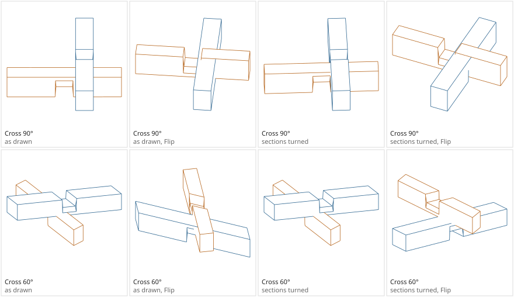

## glulamb.cross-backcut-single

**Cross lap, single backcut.** Cross lap with tapered sides that wedge the beams together.

Class `CrossSingleBackcutJoint`, 2 part(s), Cross topology.

Offered for: Cross 90°, Cross 60°.

| Parameter | Default | Unit | Description |
|---|---|---|---|
| TaperAngle | 3 | degrees | Taper angle of the backcut sides. At least 1 degree. |
| DepthOverride | 0 | length | Depth used to size the taper. 0 uses the over beam's height. |
| ExtraLength | 50 | length | Extra length added to cutters so they clear the beams. |
| Flip | false |  | Invert the automatic choice of which beam is on top. |
| ExtensionTolerance | 10 | length | Extra length added to the beam extensions this joint reports. |

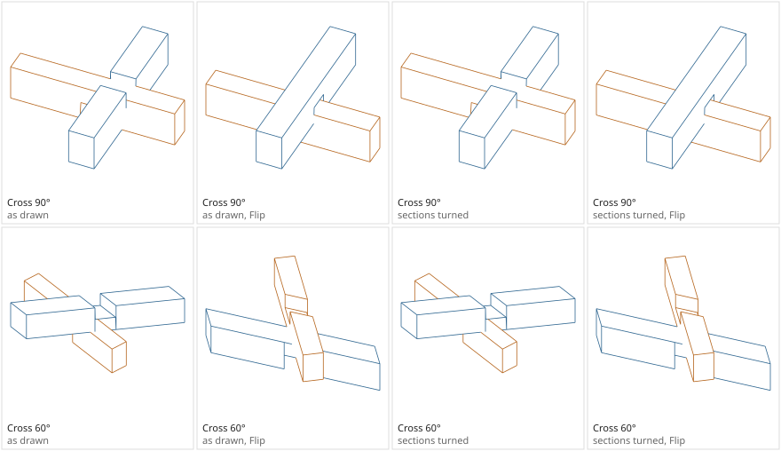

## glulamb.cross-lap

**Cross lap.** Two beams crossing, each notched by half.

Class `CrossLapJoint`, 2 part(s), Cross topology.

Offered for: **Cross 90°** (default), **Cross 60°** (default).

| Parameter | Default | Unit | Description |
|---|---|---|---|
| Added | 10 | length | Extra length added to cutters so they clear the beams. |
| Inset | 0 | length | Inset of the lap sides from the beam sides. Positive values make a tighter lap. |
| MinimumAngle | 4.98° | angle | Minimum crossing angle. |
| Flip | false |  | Invert the automatic choice of which beam is on top. |
| ExtensionTolerance | 10 | length | Extra length added to the beam extensions this joint reports. |

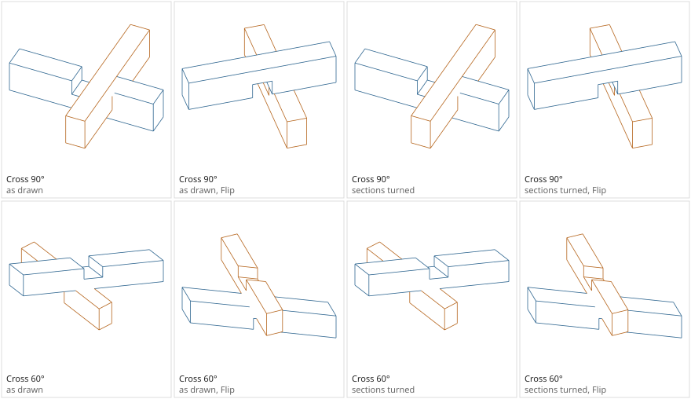

## glulamb.cross-tapered

**Tapered cross lap.** Two beams crossing, each notched by half, with tapered sides that wedge tight.

Class `TaperedCrossLapJoint`, 2 part(s), Cross topology.

Offered for: Cross 90°, Cross 60°.

| Parameter | Default | Unit | Description |
|---|---|---|---|
| Added | 10 | length | Extra size added to cutters so they clear the beams. |
| Inset | 0 | length | Inset of the lap sides from the beam sides. Positive values make a tighter lap. |
| TaperStart | 0 | length | Taper on the side of each beam facing the other beam's start: how far the side is drawn in at the lap face. |
| TaperEnd | 10 | length | Taper on the side of each beam facing the other beam's end: how far the side is drawn in at the lap face. |
| MinimumAngle | 4.98° | angle | Minimum crossing angle. |
| Flip | false |  | Invert the automatic choice of which beam is on top. |
| ExtensionTolerance | 10 | length | Extra length added to the beam extensions this joint reports. |

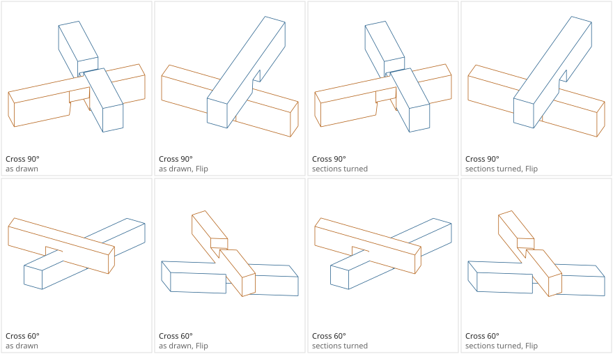

## glulamb.drilling

**Drilling.** A hole drilled into a beam at a point, square to a face.

Class `DrillingJoint`, 1 part(s), Feature topology.

Offered for: **Point on a face** (default).

| Parameter | Default | Unit | Description |
|---|---|---|---|
| Diameter | 16 | length | Hole diameter. |
| Depth | 0 | length | Hole depth from the face. 0 = through the beam. |
| Axis | 0 |  | Which face to drill from: 0 = the face towards the joint position, 1 = along the section X axis, 2 = along the section Y axis. Flip drills from the opposite face. |
| Added | 10 | length | Extra length added beyond the beam for through holes. |
| Flip | false |  | Invert the automatic choice of which beam is on top. |
| ExtensionTolerance | 10 | length | Extra length added to the beam extensions this joint reports. |

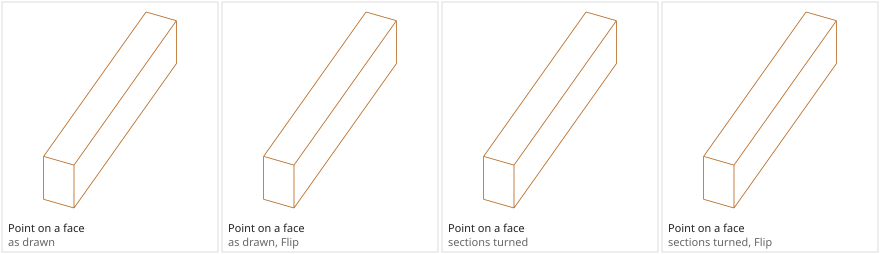

## glulamb.end-cut

**End cut.** Cuts off the end of a beam with a plane, optionally tilted or tapered.

Class `EndCutJoint`, 1 part(s), End topology.

Offered for: **Free end** (default).

| Parameter | Default | Unit | Description |
|---|---|---|---|
| Offset | 0 | length | Where the cut is, measured back from the end of the centreline. Negative cuts beyond the end (the beam is extended). |
| TiltX | 0° | angle | Tilt of the cut about the section's X axis (the end leans along Y). |
| TiltY | 0° | angle | Tilt of the cut about the section's Y axis (the end leans along X). |
| TaperLength | 0 | length | Length of the taper along the beam. 0 = no taper. |
| TaperDepth | 0 | length | How much the taper takes off the side at the end of the beam. |
| TaperBothSides | false |  | Taper both opposite sides instead of one. |
| TaperAlongX | false |  | Taper the sides along X instead of along Y. |
| Flip | false |  | Invert the automatic choice of which beam is on top. |
| ExtensionTolerance | 10 | length | Extra length added to the beam extensions this joint reports. |

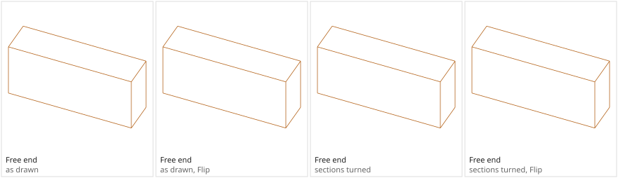

## glulamb.four-way-split

**Four-way split.** Four beam ends split along their seams and joined with a slotted-in plate.

Class `FourWaySplitJoint`, 4 part(s), Node topology.

Offered for: **Four ends** (default).

| Parameter | Default | Unit | Description |
|---|---|---|---|
| PlateThickness | 20 | length | Plate thickness. |
| PlateDepth | 80 | length | Depth of the plate slots into the arms. |
| MaxPlateDepth | 120 | length | Largest slot depth when the slot is tilted. |
| PlateLength | 100 | length | Length of the plate along each arm. |
| ToleranceSlotEnd | 1.5 | length | Clearance at the end of the plate slots. |
| DowelPosition | 70 | length | Distance of the dowels from the node. |
| DowelDiameter | 12 | length | Dowel diameter. |
| DowelLength | 140 | length | Dowel length. |
| Added | 50 | length | Extra length added to cutters so they clear the beams. |
| AddedSlot | 50 | length | Extra length of the plate slots towards the node. |
| AddedPlaneOffset | 150 | length | How far the split cutters reach above and below the plate. |
| ToolDiameter | 16 | length | Tool diameter for slot corner radii. |
| Flip | false |  | Invert the automatic choice of which beam is on top. |
| ExtensionTolerance | 10 | length | Extra length added to the beam extensions this joint reports. |

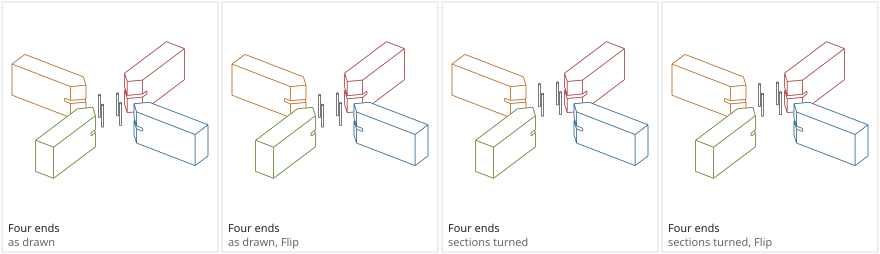

- Note: FourWaySplitJoint: the plate itself isn't generated yet (the original only cut the slots).

## glulamb.k-plate

**K plate.** Two beams ending on the side of a third, joined with a slotted-in plate and dowels.

Class `KPlateJoint`, 3 part(s), Node topology.

Offered for: **K 45°/45°** (default), **K 60°/40°** (default).

| Parameter | Default | Unit | Description |
|---|---|---|---|
| PlateDepth | 50 | length | Depth of the plate's tenon into the sill. |
| PlateSlotDepth | 50 | length | Depth of the tenon slot in the sill. |
| PlateThickness | 20 | length | Plate thickness. |
| PlateOffset | 0 | length | Offset of the plate from the arm centrelines, along the plate normal. |
| PlateEndOffset | 0 | length | Extra length of the plate along the arms. |
| ToolDiameter | 16 | length | Tool diameter for slot and plate corner radii. |
| DowelPosition | 40 | length | Distance of the arm dowels from the sill face. |
| DowelLength | 130 | length | Dowel length. |
| DowelDrillDepth | 270 | length | Depth of the drilled dowel holes in the arms. |
| DowelDiameter | 16 | length | Dowel diameter. |
| Added | 5 | length | Extra length added to cutters so they clear the beams. |
| ToleranceTenonSide | 0.5 | length | Clearance on each side of the plate tenon in the sill slot. |
| ToleranceTenonEnd | 1.5 | length | Clearance at the end of the plate tenon. |
| ToleranceSlotEnd | 1.5 | length | Clearance at the end of the plate slots in the arms. |
| TenonWidth | 0 | length | Width of the plate tenon and its slot in the sill, along the sill. 0 = automatic: just wide enough for the arms and the tool radius. (PlateWidth in KJoint_Plate4.) |
| MinimumSlotLength | 40 | length | Shortest length of the plate and its slots along each edge of an arm, measured from the sill face. |
| SingleInsertionDirection | true |  | Insert the plate from one direction (slot ends parallel), instead of along each arm. |
| Mode | 0 |  | How the arms meet: 0 split down the seam, -1 arm 0 into the side of arm 1, 1 arm 1 into arm 0. |
| Flip | false |  | Invert the automatic choice of which beam is on top. |
| ExtensionTolerance | 10 | length | Extra length added to the beam extensions this joint reports. |

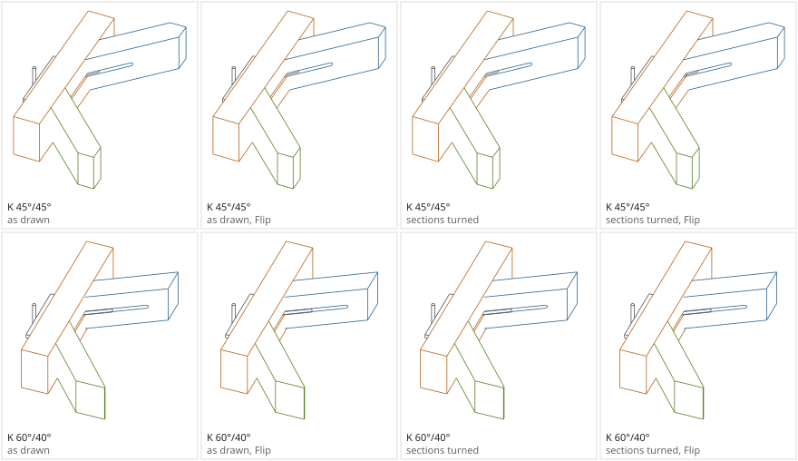

- Note: KPlateJoint: the plate tenon doesn't reach the sill dowel; set PlateDepth and PlateSlotDepth to at least 88 (now 50 and 50).

## glulamb.k-plate-joist

**K plate with joist.** K plate joint with an extra joist ending at the sill and notched into it.

Class `KPlateJoistJoint`, 4 part(s), Node topology.

Offered for: **K 45°/45° with a joist** (default).

| Parameter | Default | Unit | Description |
|---|---|---|---|
| JoistInset | 40 | length | How far the joist notch runs back into the joist from the plate. |
| JoistNotchLength | 70 | length | Length of the joist notch along the joist, before the angle correction. |
| PlateDepth | 50 | length | Depth of the plate's tenon into the sill. |
| PlateSlotDepth | 50 | length | Depth of the tenon slot in the sill. |
| PlateThickness | 20 | length | Plate thickness. |
| PlateOffset | 0 | length | Offset of the plate from the arm centrelines, along the plate normal. |
| PlateEndOffset | 0 | length | Extra length of the plate along the arms. |
| ToolDiameter | 16 | length | Tool diameter for slot and plate corner radii. |
| DowelPosition | 40 | length | Distance of the arm dowels from the sill face. |
| DowelLength | 130 | length | Dowel length. |
| DowelDrillDepth | 270 | length | Depth of the drilled dowel holes in the arms. |
| DowelDiameter | 16 | length | Dowel diameter. |
| Added | 5 | length | Extra length added to cutters so they clear the beams. |
| ToleranceTenonSide | 0.5 | length | Clearance on each side of the plate tenon in the sill slot. |
| ToleranceTenonEnd | 1.5 | length | Clearance at the end of the plate tenon. |
| ToleranceSlotEnd | 1.5 | length | Clearance at the end of the plate slots in the arms. |
| TenonWidth | 0 | length | Width of the plate tenon and its slot in the sill, along the sill. 0 = automatic: just wide enough for the arms and the tool radius. (PlateWidth in KJoint_Plate4.) |
| MinimumSlotLength | 40 | length | Shortest length of the plate and its slots along each edge of an arm, measured from the sill face. |
| SingleInsertionDirection | true |  | Insert the plate from one direction (slot ends parallel), instead of along each arm. |
| Mode | 0 |  | How the arms meet: 0 split down the seam, -1 arm 0 into the side of arm 1, 1 arm 1 into arm 0. |
| Flip | false |  | Invert the automatic choice of which beam is on top. |
| ExtensionTolerance | 10 | length | Extra length added to the beam extensions this joint reports. |

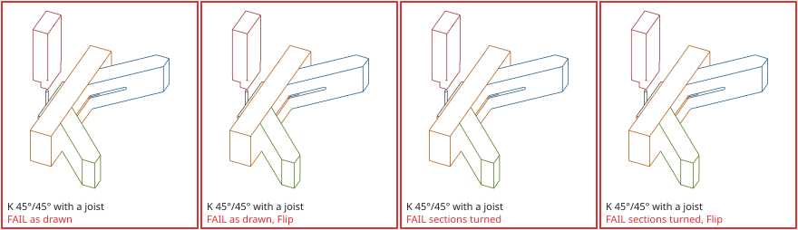

- Fails on K 45°/45° with a joist, as drawn: beams S and J overlap by 1796.9 cm³
- Fails on K 45°/45° with a joist, as drawn, Flip: beams S and J overlap by 1796.9 cm³
- Fails on K 45°/45° with a joist, sections turned: beams S and J overlap by 1796.9 cm³
- Fails on K 45°/45° with a joist, sections turned, Flip: beams S and J overlap by 1796.9 cm³
- Note: KPlateJoistJoint: the plate tenon doesn't reach the sill dowel; set PlateDepth and PlateSlotDepth to at least 88 (now 50 and 50).

## glulamb.k-tenon

**K mortise and tenon.** Two beams ending on the side of a third: one tenoned through it, the other butting against the first.

Class `KTenonJoint`, 3 part(s), Node topology.

Offered for: K 45°/45°, K 60°/40°.

| Parameter | Default | Unit | Description |
|---|---|---|---|
| TenonThickness | 0 | length | Tenon thickness. 0 = a third of the arm, across the plane of the joint. |
| TenonInset | 0 | length | Shoulder on each side of the tenon in the plane of the joint. |
| TenonLength | 0 | length | Tenon length into the sill, measured square to the sill face. 0 = through the sill. |
| Clearance | 0.5 | length | Clearance on each side of the tenon in the mortise. |
| EndClearance | 2 | length | Clearance beyond the end of a blind tenon. |
| ToolDiameter | 16 | length | Tool diameter: the mortise corners and tenon edges are rounded to its radius. 0 = sharp. |
| DowelDiameter | 0 | length | Peg diameter, across the sill and the tenon. 0 = no peg. |
| Added | 10 | length | Extra length added to cutters so they clear the beams. |
| Flip | false |  | Invert the automatic choice of which beam is on top. |
| ExtensionTolerance | 10 | length | Extra length added to the beam extensions this joint reports. |

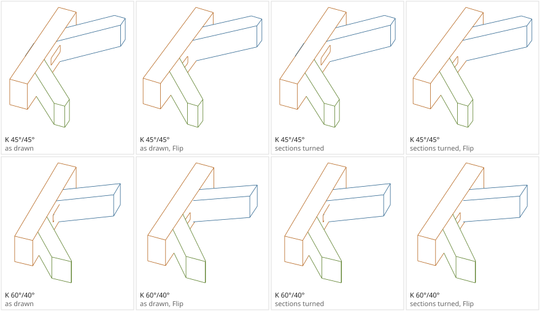

## glulamb.plate-pocket

**Plate pocket.** A steel plate let into a beam face, with screws and an optional bolt.

Class `PlatePocketJoint`, 1 part(s), Feature topology.

Offered for: Point on a face.

| Parameter | Default | Unit | Description |
|---|---|---|---|
| Length | 160 | length | Pocket length, along the beam. |
| Width | 0 | length | Pocket width, across the face. 0 = the full face, running out at both sides. |
| Depth | 10 | length | Pocket depth. |
| PlateThickness | 0 | length | Plate thickness. 0 = the pocket depth. |
| ToolDiameter | 0 | length | Tool diameter: the pocket corners are rounded to its radius. 0 = sharp. |
| Axis | 0 |  | Which face: 0 = the face towards the joint position, 1 = along the section X axis, 2 = along the section Y axis. Flip uses the opposite face. |
| CounterboreDiameter | 44 | length | Counterbore diameter in the middle of the pocket, e.g. for a bolt head or nut. 0 = none. |
| CounterboreDepth | 12 | length | Counterbore depth below the bottom of the pocket. |
| BoltDiameter | 0 | length | Bolt hole diameter, through the beam from the middle of the pocket. 0 = none. |
| ScrewDiameter | 6 | length | Screw diameter. 0 = no screws. |
| ScrewLength | 60 | length | Screw length, from the bottom of the pocket. |
| ScrewEdgeOffsetX | 15 | length | Distance of the screws from the pocket ends. |
| ScrewEdgeOffsetY | 20 | length | Distance of the screws from the pocket sides (from the face sides for a full-width pocket). |
| ScrewInclination | 0° | angle | Lean of the screws along the beam, away from the middle of the pocket. |
| Added | 10 | length | Extra size added to cutters so they clear the beam. |
| Flip | false |  | Invert the automatic choice of which beam is on top. |
| ExtensionTolerance | 10 | length | Extra length added to the beam extensions this joint reports. |

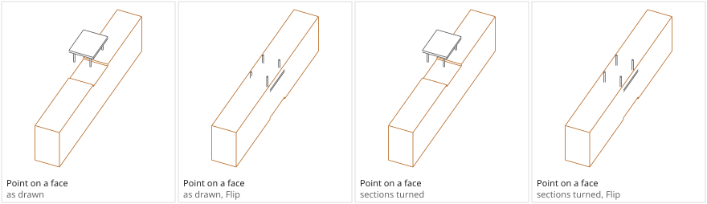

## glulamb.post-beams

**Beams on a post.** Two beam ends against the sides of a post running past them, optionally seated and tenoned.

Class `PostBeamsJoint`, 3 part(s), Node topology.

Offered for: **Post running past** (default), **Post running past, 17° skew** (default).

| Parameter | Default | Unit | Description |
|---|---|---|---|
| SeatDepth | 20 | length | Depth of the seat (housing of the beam's full section) in the post. 0 = no seat. |
| TenonLength | 0 | length | Length of a blind tenon into the post, from its face. 0 = no tenon. |
| TenonThickness | 0 | length | Tenon thickness. 0 = a third of the beam, across the plane of the beam and the post. |
| TenonInset | 20 | length | Shoulder on each side of the tenon in the other direction. |
| Rotate | false |  | Turn the tenons a quarter turn. |
| Clearance | 0.5 | length | Clearance on each side of a tenon in its mortise. |
| EndClearance | 2 | length | Clearance beyond the end of a tenon. |
| ToolDiameter | 16 | length | Tool diameter: mortise corners and tenon edges are rounded to its radius. 0 = sharp. |
| Added | 10 | length | Extra size added to cutters so they clear the beams. |
| Flip | false |  | Invert the automatic choice of which beam is on top. |
| ExtensionTolerance | 10 | length | Extra length added to the beam extensions this joint reports. |

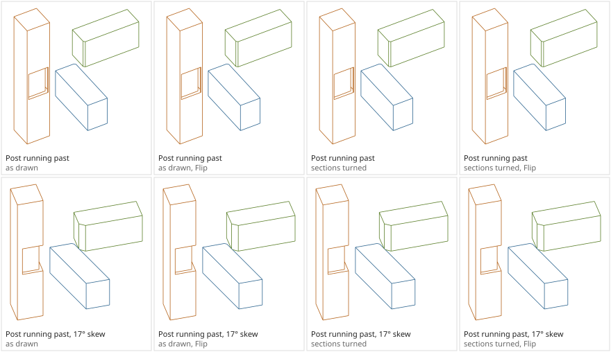

## glulamb.post-lap

**Lapped beams on a post.** Two beam ends corner-lapped on top of the end of a post.

Class `PostLapJoint`, 3 part(s), Node topology.

Offered for: **Post corner** (default).

| Parameter | Default | Unit | Description |
|---|---|---|---|
| TenonMode | 0 |  | Tenon: 0 = none (the beams sit on the post), 1 = through both laps, 2 = blind. |
| TenonWidth | 0 | length | Tenon size along the post's section X axis. 0 = a third of the post. |
| TenonThickness | 0 | length | Tenon size along the post's section Y axis. 0 = a third of the post. |
| TenonLength | 0 | length | Length of a blind tenon, from the underside of the beams. 0 = half their depth. |
| Clearance | 0.5 | length | Clearance on each side of the tenon in the mortise. |
| EndClearance | 2 | length | Clearance beyond the end of a blind tenon. |
| ToolDiameter | 16 | length | Tool diameter: the tenon edges and mortise corners along the post are rounded to its radius. 0 = sharp. |
| Added | 10 | length | Extra size added to cutters so they clear the beams. |
| Flip | false |  | Invert the automatic choice of which beam is on top. |
| ExtensionTolerance | 10 | length | Extra length added to the beam extensions this joint reports. |

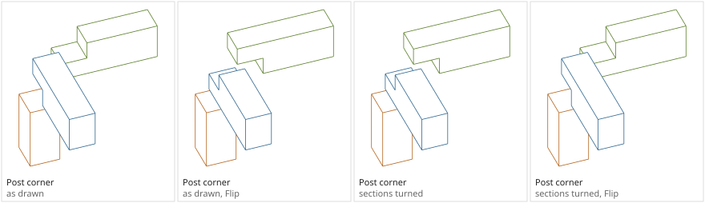

## glulamb.post-lap-tenon

**Lapped beams on a post, through tenon.** Two beam ends corner-lapped on top of a post, with the post's tenon through both laps.

Class `PostLapTenonJoint`, 3 part(s), Node topology.

Offered for: Post corner.

| Parameter | Default | Unit | Description |
|---|---|---|---|
| TenonMode | 1 |  | Tenon: 0 = none (the beams sit on the post), 1 = through both laps, 2 = blind. |
| TenonWidth | 0 | length | Tenon size along the post's section X axis. 0 = a third of the post. |
| TenonThickness | 0 | length | Tenon size along the post's section Y axis. 0 = a third of the post. |
| TenonLength | 0 | length | Length of a blind tenon, from the underside of the beams. 0 = half their depth. |
| Clearance | 0.5 | length | Clearance on each side of the tenon in the mortise. |
| EndClearance | 2 | length | Clearance beyond the end of a blind tenon. |
| ToolDiameter | 16 | length | Tool diameter: the tenon edges and mortise corners along the post are rounded to its radius. 0 = sharp. |
| Added | 10 | length | Extra size added to cutters so they clear the beams. |
| Flip | false |  | Invert the automatic choice of which beam is on top. |
| ExtensionTolerance | 10 | length | Extra length added to the beam extensions this joint reports. |

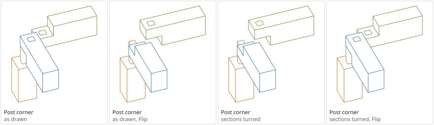

## glulamb.post-lap-tenon-blind

**Lapped beams on a post, blind tenon.** Two beam ends corner-lapped on top of a post, with the post's blind tenon into the laps.

Class `PostLapBlindTenonJoint`, 3 part(s), Node topology.

Offered for: Post corner.

| Parameter | Default | Unit | Description |
|---|---|---|---|
| TenonMode | 2 |  | Tenon: 0 = none (the beams sit on the post), 1 = through both laps, 2 = blind. |
| TenonWidth | 0 | length | Tenon size along the post's section X axis. 0 = a third of the post. |
| TenonThickness | 0 | length | Tenon size along the post's section Y axis. 0 = a third of the post. |
| TenonLength | 0 | length | Length of a blind tenon, from the underside of the beams. 0 = half their depth. |
| Clearance | 0.5 | length | Clearance on each side of the tenon in the mortise. |
| EndClearance | 2 | length | Clearance beyond the end of a blind tenon. |
| ToolDiameter | 16 | length | Tool diameter: the tenon edges and mortise corners along the post are rounded to its radius. 0 = sharp. |
| Added | 10 | length | Extra size added to cutters so they clear the beams. |
| Flip | false |  | Invert the automatic choice of which beam is on top. |
| ExtensionTolerance | 10 | length | Extra length added to the beam extensions this joint reports. |

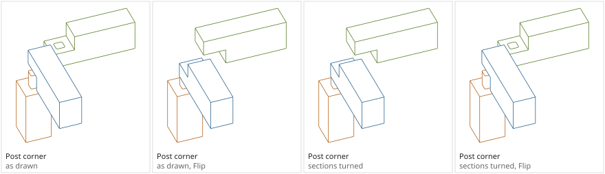

## glulamb.splice-birdsmouth

**Birdsmouth splice.** Two aligned beam ends meeting on a V, dowelled and optionally screwed.

Class `BirdsMouthSpliceJoint`, 2 part(s), Splice topology.

Offered for: Splice 180°, Splice 165°.

| Parameter | Default | Unit | Description |
|---|---|---|---|
| Angle | 30.02° | angle | Angle of the V faces to the cross-section. |
| Rotate | false |  | Run the V across the shallower side of the section instead of the deeper one. |
| Added | 10 | length | Extra size added to cutters so they clear the beams. |
| DowelDiameter | 12 | length | Dowel diameter. 0 = no dowels. |
| DowelLength | 150 | length | Dowel length, centred on the joint. |
| DowelDrillExtra | 5 | length | Extra depth drilled beyond each end of a dowel. |
| ScrewDiameter | 6 | length | Screw diameter. 0 = no screws. |
| ScrewLength | 180 | length | Screw length. |
| ScrewAngle | 44.98° | angle | Angle of the screws to the beam face normal, leaning across the joint. |
| ScrewDistance | 50 | length | Distance of the screw heads from the joint, on beam 0. |
| ScrewSpacing | 30 | length | Distance of the screws from the middle of the face. |
| CountersinkDiameter | 14 | length | Countersink diameter. 0 = no countersink. |
| CountersinkDepth | 10 | length | Countersink depth. |
| MaximumAngle | 30.02° | angle | Largest angle between the beams that the splice will handle. |
| Flip | false |  | Invert the automatic choice of which beam is on top. |
| ExtensionTolerance | 10 | length | Extra length added to the beam extensions this joint reports. |

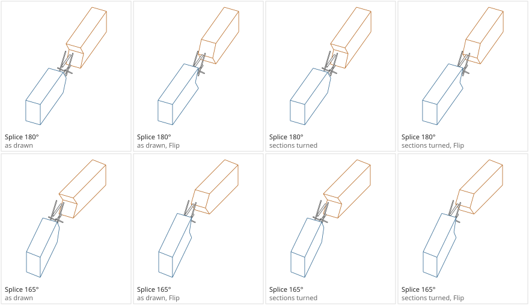

## glulamb.splice-lap

**Lapped splice.** Two aligned beam ends lapped over each other and dowelled.

Class `LappedSpliceJoint`, 2 part(s), Splice topology.

Offered for: **Splice 180°** (default), **Splice 165°** (default).

| Parameter | Default | Unit | Description |
|---|---|---|---|
| Added | 10 | length | Extra width added to cutters so they clear the beams. |
| AddedUp | 100 | length | Extra height added to cutters above and below the beams. |
| SpliceLength | 200 | length | Length of the lap. |
| SpliceRatio | 0.25 |  | Height of the lap step as a ratio of the beam height. |
| SideSplice | false |  | Lap through the width of the beams instead of the height. |
| DowelEndOffset | 60 | length | Distance of the dowels from the ends of the lap. |
| DowelDiameter | 16 | length | Dowel diameter. 0 means no dowels. |
| MaximumAngle | 44.98° | angle | Largest angle between the beams that the splice will handle. |
| Flip | false |  | Invert the automatic choice of which beam is on top. |
| ExtensionTolerance | 10 | length | Extra length added to the beam extensions this joint reports. |

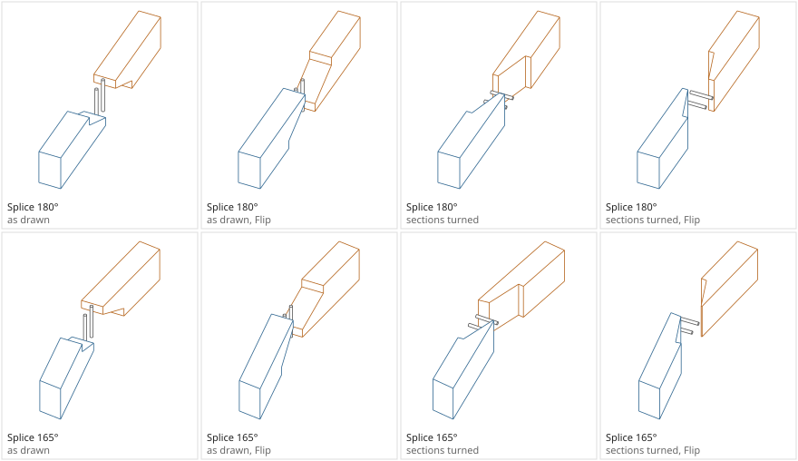

## glulamb.splice-scarf-keyed

**Keyed scarf splice.** Two aligned beam ends joined with a sloped, stepped scarf, a key and dowels.

Class `SteppedScarfJoint`, 2 part(s), Splice topology.

Offered for: Splice 180°, Splice 165°.

| Parameter | Default | Unit | Description |
|---|---|---|---|
| Added | 10 | length | Extra width added to cutters so they clear the beams. |
| AddedUp | 100 | length | Extra height added to cutters above and below the beams. |
| SpliceLength | 200 | length | Length of the scarf along the beams. |
| SpliceAngle | 15.01° | angle | Slope of the scarf face to the beam axis. |
| StepWidth | 20 | length | Height of the step in the scarf face (the key thickness). 0 = a plain sloped scarf. |
| PinWidth | 20 | length | Width of the key slot between the two steps. 0 = no key. |
| SideSplice | false |  | Scarf through the width of the beams instead of the height. |
| SquareEnds | false |  | Cut the ends of the scarf square to the beams instead of square to the scarf face. |
| DowelsSquareToScarf | false |  | Run the dowels square to the scarf face instead of square to the beams. |
| DowelEndOffset | 60 | length | Distance of the dowels from the ends of the scarf. |
| DowelDiameter | 16 | length | Dowel diameter. 0 means no dowels. |
| MaximumAngle | 30.02° | angle | Largest angle between the beams that the splice will handle. |
| Flip | false |  | Invert the automatic choice of which beam is on top. |
| ExtensionTolerance | 10 | length | Extra length added to the beam extensions this joint reports. |

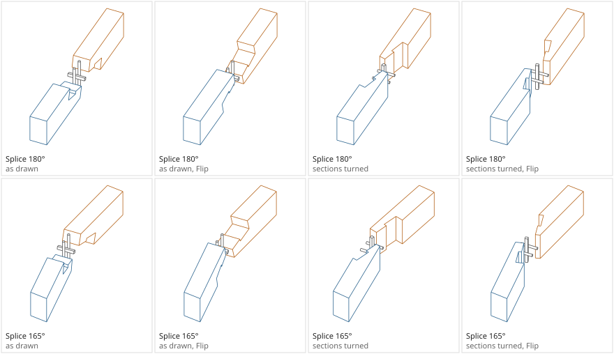

## glulamb.splice-tenon

**Tenon splice.** Two aligned beam ends joined with a through tongue and slot, dowelled across.

Class `TenonSpliceJoint`, 2 part(s), Splice topology.

Offered for: Splice 180°, Splice 165°.

| Parameter | Default | Unit | Description |
|---|---|---|---|
| Added | 10 | length | Extra width added to cutters so they clear the beams. |
| AddedUp | 100 | length | Extra height added to cutters above and below the beams. |
| SpliceLength | 200 | length | Length of the tongue. |
| TenonRatio | 0.333 |  | Width of the tongue as a ratio of the narrower beam's width. |
| SideSplice | false |  | Run the tongue through the width of the beams instead of the height. |
| DowelEndOffset | 60 | length | Distance of the dowels from the ends of the tongue. |
| DowelDiameter | 16 | length | Dowel diameter. 0 means no dowels. |
| MaximumAngle | 44.98° | angle | Largest angle between the beams that the splice will handle. |
| Flip | false |  | Invert the automatic choice of which beam is on top. |
| ExtensionTolerance | 10 | length | Extra length added to the beam extensions this joint reports. |

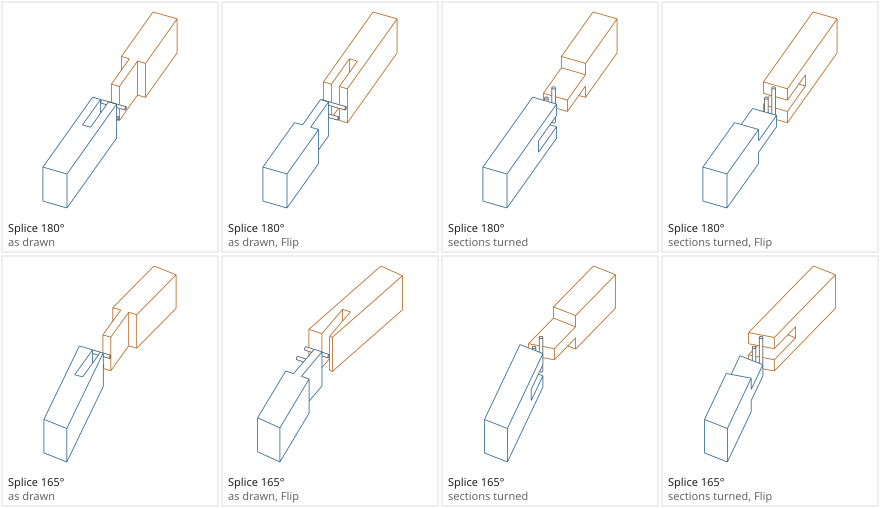

## glulamb.splice-tenon-blind

**Blind tenon splice.** Two beam ends butted together with a blind tenon and a dowel.

Class `BlindTenonSpliceJoint`, 2 part(s), Splice topology.

Offered for: Splice 180°, Splice 165°.

| Parameter | Default | Unit | Description |
|---|---|---|---|
| TenonLength | 100 | length | Tenon length. |
| TenonWidth | 40 | length | Tenon width (along the section X axis). Limited to the beam width. |
| TenonHeight | 80 | length | Tenon height (along the section Y axis). Limited to the beam height. |
| Added | 10 | length | Extra size added to cutters so they clear the beams. |
| ToolDiameter | 16 | length | Tool diameter: the tenon and mortise edges are rounded to its radius. |
| ToleranceSide | 0.5 | length | Clearance on each side of the tenon in the mortise. |
| ToleranceEnd | 1.5 | length | Clearance beyond the end of the tenon. |
| DowelDiameter | 12 | length | Dowel diameter. 0 = no dowel. |
| DowelLength | 220 | length | Dowel length. |
| DowelLengthExtra | 15 | length | How far the dowel hole starts before the beam face. |
| DowelSideTolerance | 0.5 | length | Draw-bore: offset of the dowel hole in the mortise beam, away from the shoulder. |
| Flip | false |  | Invert the automatic choice of which beam is on top. |
| ExtensionTolerance | 10 | length | Extra length added to the beam extensions this joint reports. |

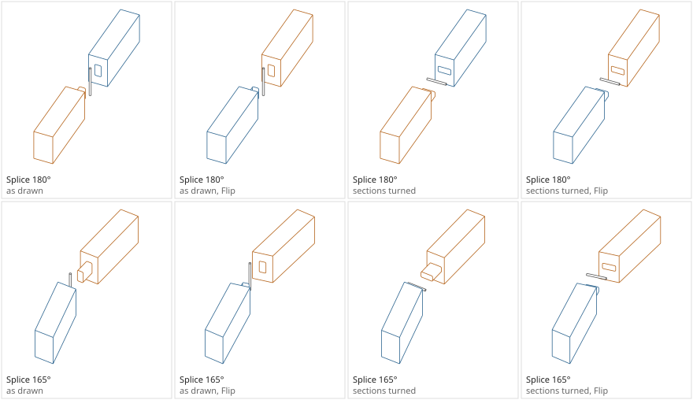

## glulamb.t-butt

**T butt.** A beam butting against the side of another, dowelled through the other, optionally housed.

Class `TButtJoint`, 2 part(s), T topology.

Offered for: T 90°, T 60°, T 45°.

| Parameter | Default | Unit | Description |
|---|---|---|---|
| Depth | 10 | length | Depth of the seat (housing) for the arm in the sill, mostly for locating it. 0 = no seat. |
| SquareObtuseSide | true |  | On an angled arm, cut the seat wall and the arm's toe square to the sill face on the obtuse side, so no corner is under 90° (machinable, and no bearing on an edge). |
| Clearance | 0 | length | Clearance around the arm in the housing. |
| DowelCount | 2 |  | Number of dowels, spread across the arm in the plane of the joint. |
| DowelSpacing | 80 | length | Distance between dowels. |
| DowelDiameter | 12 | length | Dowel diameter. 0 = no dowels. |
| DowelEmbedment | 100 | length | How far the dowels go into the arm, from the cut end. |
| DowelDrillExtra | 10 | length | Extra depth drilled beyond the end of the dowel. |
| Added | 10 | length | Extra size added to cutters so they clear the beams. |
| Flip | false |  | Invert the automatic choice of which beam is on top. |
| ExtensionTolerance | 10 | length | Extra length added to the beam extensions this joint reports. |

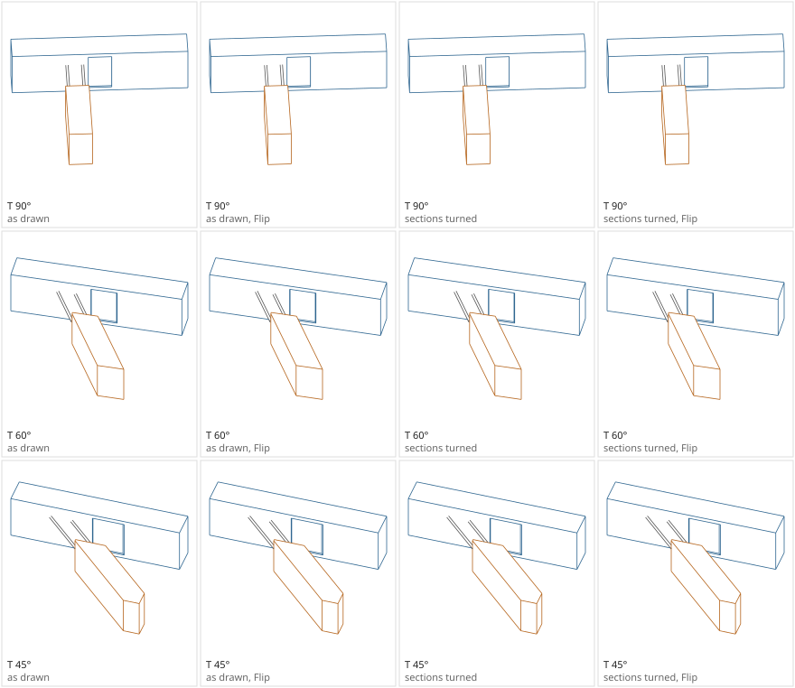

## glulamb.t-dovetail

**T dovetail.** End of one beam dovetailed into the side of another.

Class `DovetailTJoint`, 2 part(s), T topology.

Offered for: T 90°, T 60°, T 45°.

| Parameter | Default | Unit | Description |
|---|---|---|---|
| Added | 10 | length | Extra length added to cutters so they clear the beams. |
| NeckOffset | 20 | length | Inset of the dovetail neck from the tenon sides. |
| Depth | 10 | length | Depth of the dovetail into the mortise beam. |
| Angle | 30.02° | angle | Dovetail angle. |
| DowelDiameter | 16 | length | Diameter of the dowel along the tenon. 0 means no dowel. |
| Flip | false |  | Invert the automatic choice of which beam is on top. |
| ExtensionTolerance | 10 | length | Extra length added to the beam extensions this joint reports. |

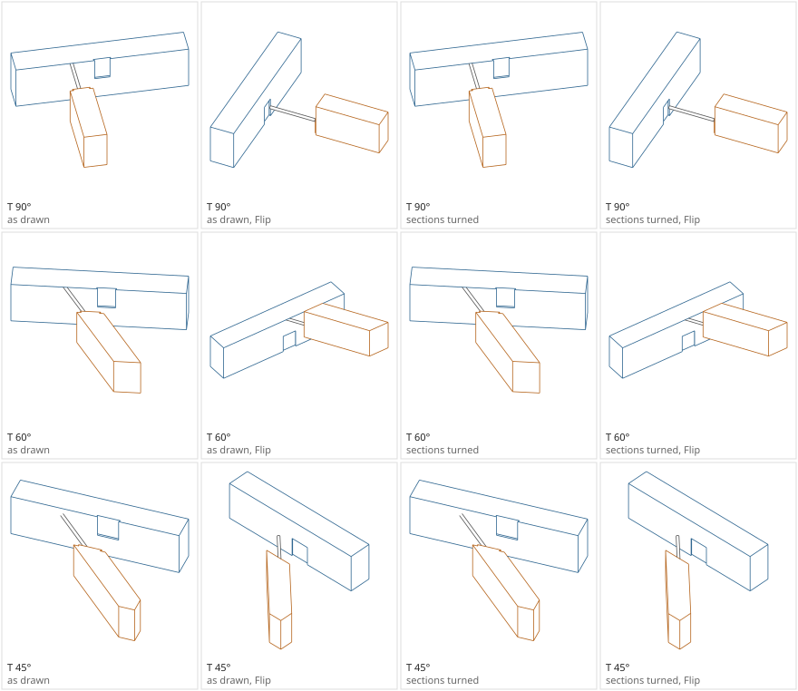

## glulamb.t-housed

**T housed tenon.** End of one beam housed into the side of another, with a half-lap tongue and angled shoulders.

Class `TenonHousedJoint`, 2 part(s), T topology.

Offered for: T 90°, T 60°, T 45°.

| Parameter | Default | Unit | Description |
|---|---|---|---|
| Added | 10 | length | Extra length added to cutters so they clear the beams. |
| BlindOffset | 0 | length | Distance from the far side of the mortise beam to the end of the tongue. 0 runs through. |
| ThicknessOffset | 0 | length | How much narrower the tongue is than the tenon beam, on each side. |
| BackOffset | 10 | length | Depth of the full-section housing past the shoulder. |
| OutInset | 5 | length | Depth of the shoulder into the mortise beam's face. |
| Flip | false |  | Invert the automatic choice of which beam is on top. |
| ExtensionTolerance | 10 | length | Extra length added to the beam extensions this joint reports. |

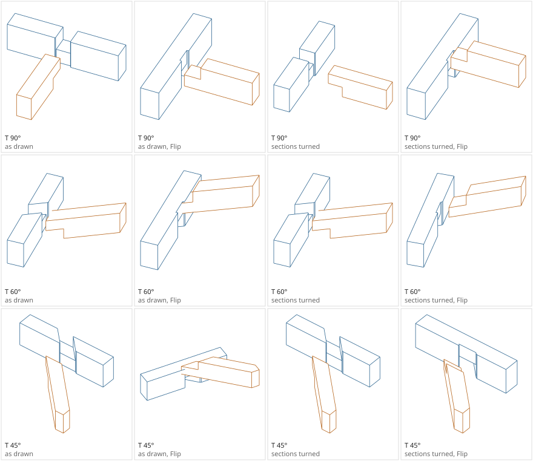

## glulamb.t-lap

**T lap.** End of one beam lapped onto the side of another.

Class `TLapJoint`, 2 part(s), T topology.

Offered for: **T 90°** (default), **T 60°** (default), **T 45°** (default).

| Parameter | Default | Unit | Description |
|---|---|---|---|
| Added | 10 | length | Extra length added to cutters so they clear the beam. |
| BlindOffset | 0 | length | Distance from the far side of the mortise beam to the end of the lap. 0 is a through lap. |
| DowelDiameter | 0 | length | Diameter of a dowel through the middle of the lap. 0 means no dowel. |
| Flip | false |  | Invert the automatic choice of which beam is on top. |
| ExtensionTolerance | 10 | length | Extra length added to the beam extensions this joint reports. |

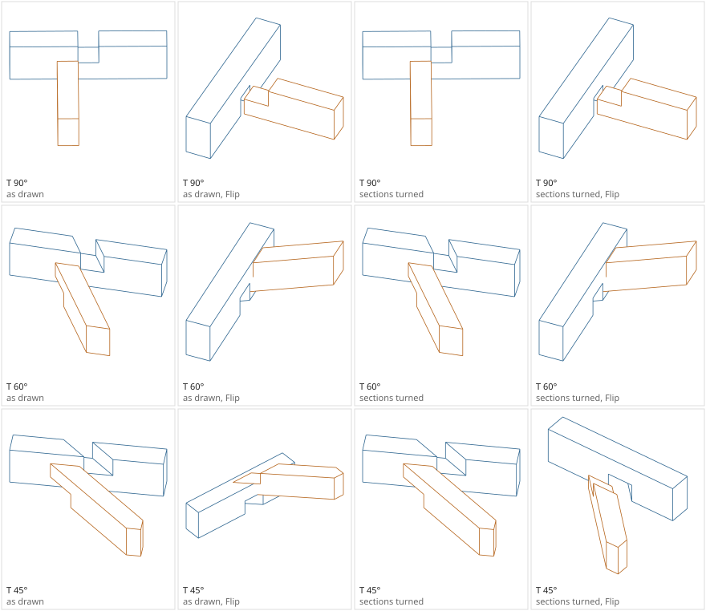

## glulamb.t-plate

**T plate.** A beam ending on the side of another, joined with a slotted-in plate and dowels.

Class `TPlateJoint`, 2 part(s), T topology.

Offered for: T 90°, T 60°, T 45°.

| Parameter | Default | Unit | Description |
|---|---|---|---|
| PlateDepth | 50 | length | Depth of the plate's tenon into the sill. |
| PlateSlotDepth | 50 | length | Depth of the tenon slot in the sill. |
| PlateThickness | 20 | length | Plate thickness. |
| PlateOffset | 0 | length | Offset of the plate from the arm centreline, across the plane of the joint. |
| PlateEndOffset | 0 | length | Extra length of the plate along the arm. |
| TenonWidth | 0 | length | Width of the plate tenon and its slot in the sill, along the sill. 0 = automatic: as wide as the arm plus the tool radius. |
| MinimumSlotLength | 40 | length | Shortest length of the plate along each edge of the arm, from the sill face. |
| ToolDiameter | 16 | length | Tool diameter for slot and plate corner radii. |
| DowelPosition | 40 | length | Distance of the arm dowel from the sill face. |
| DowelLength | 130 | length | Dowel length. |
| DowelDiameter | 16 | length | Dowel diameter. |
| Added | 5 | length | Extra length added to cutters so they clear the beams. |
| ToleranceTenonSide | 0.5 | length | Clearance on each side of the plate tenon in the sill slot. |
| ToleranceTenonEnd | 1.5 | length | Clearance at the end of the plate tenon. |
| ToleranceSlotEnd | 1.5 | length | Clearance at the end of the plate slot in the arm. |
| Flip | false |  | Invert the automatic choice of which beam is on top. |
| ExtensionTolerance | 10 | length | Extra length added to the beam extensions this joint reports. |

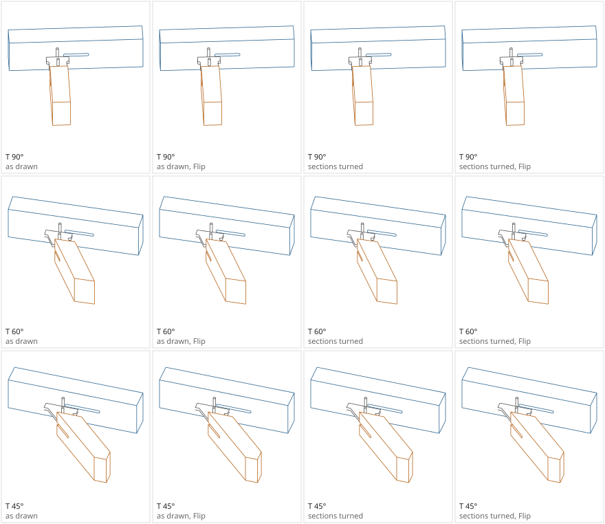

- Note: TPlateJoint: the plate tenon doesn't reach the sill dowel; set PlateDepth and PlateSlotDepth to at least 88 (now 50 and 50).

## glulamb.t-step

**Step joint.** An angled strut bearing in a step notch in the side of another beam, optionally seated and tenoned.

Class `TStepJoint`, 2 part(s), T topology.

Offered for: T 90°, T 60°, T 45°.

| Parameter | Default | Unit | Description |
|---|---|---|---|
| StepType | 0 |  | Step: 0 = front step (Stirnversatz), 1 = heel step (Fersenversatz), 2 = double (both), 3 = square front step (the two notch faces at 90°, easier to cut). |
| StepDepth | 0 | length | Depth of the front step below the sill face (or seat), square to it. 0 = StepDepthRatio times the sill depth. |
| HeelDepth | 0 | length | Depth of the heel below the sill face (or seat), square to it. 0 = the step depth plus 15 for a double step, else the same as StepDepth. |
| StepDepthRatio | 0.2 |  | With StepDepth 0: the front step depth as a ratio of the sill depth (traditionally 1/6 to 1/4). |
| SeatDepth | 0 | length | Depth of a seat for the arm's full section in the sill, mostly for locating it. 0 = none. |
| SquareObtuseSide | true |  | In a seat, cut the seat wall and the arm's toe square to the sill face on the obtuse side. |
| TenonLength | 0 | length | Length of a blind tenon along the arm, measured square to the sill face from the seat (or face). 0 = no tenon. |
| TenonThickness | 0 | length | Tenon thickness, across the plane of the joint. 0 = a third of the arm. |
| TenonInset | 20 | length | Shoulder on each side of the tenon in the plane of the joint. |
| Clearance | 0.5 | length | Clearance on each side of the tenon in the mortise. |
| EndClearance | 2 | length | Clearance beyond the end of the tenon. |
| ToolDiameter | 16 | length | Tool diameter: the tenon edges and mortise corners are rounded to its radius. 0 = sharp. |
| Added | 10 | length | Extra size added to cutters so they clear the beams. |
| Flip | false |  | Invert the automatic choice of which beam is on top. |
| ExtensionTolerance | 10 | length | Extra length added to the beam extensions this joint reports. |

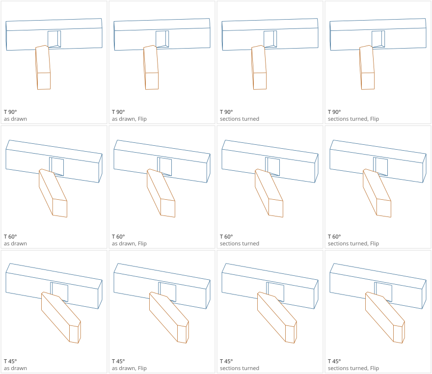

## glulamb.t-tenon

**T mortise and tenon.** A beam ending on the side of another with a tenon in a mortise, optionally pegged.

Class `TTenonJoint`, 2 part(s), T topology.

Offered for: T 90°, T 60°, T 45°.

| Parameter | Default | Unit | Description |
|---|---|---|---|
| TenonThickness | 0 | length | Tenon thickness. 0 = a third of the arm, across the thin direction. |
| TenonInset | 20 | length | Shoulder on each side of the tenon in the other direction. |
| TenonLength | 0 | length | Tenon length into the sill, measured square to the sill face. 0 = through the sill. |
| Rotate | false |  | Turn the tenon a quarter turn: thin in the plane of the joint instead of across it. |
| HousingDepth | 0 | length | Depth of a housing (seat) for the arm's full section in the sill face, with the shoulder at its bottom. 0 = no housing. |
| SquareObtuseSide | true |  | On an angled arm in a housing, cut the housing wall and the arm's toe square to the sill face on the obtuse side, so no corner is under 90°. |
| Clearance | 0.5 | length | Clearance on each side of the tenon in the mortise. |
| EndClearance | 2 | length | Clearance beyond the end of a blind tenon. |
| ToolDiameter | 16 | length | Tool diameter: the mortise corners and tenon edges are rounded to its radius. 0 = sharp. |
| DowelDiameter | 0 | length | Peg diameter. 0 = no peg. |
| Added | 10 | length | Extra length added to cutters so they clear the beams. |
| Flip | false |  | Invert the automatic choice of which beam is on top. |
| ExtensionTolerance | 10 | length | Extra length added to the beam extensions this joint reports. |

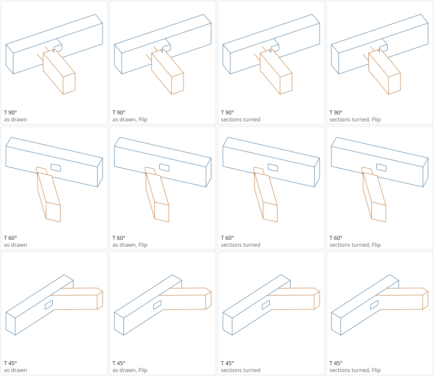

